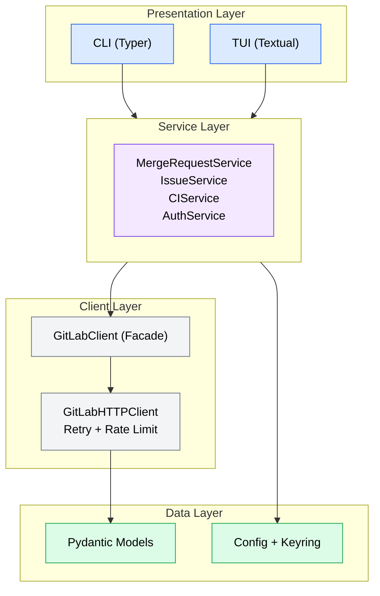

# gltools

A Python-based CLI and TUI for interacting with GitLab repositories, issues, merge requests, and CI/CD pipelines. The CLI is optimized for coding agents (structured JSON output) while the TUI is optimized for interactive human use.

## Installation

### pip

```bash
pip install gltools
```

### uvx (no install required)

```bash
uvx gltools --help
```

### From source

```bash
git clone https://github.com/yourusername/gltools.git
cd gltools
uv sync
```

**Requirements:** Python 3.12+

## Quick Start

### 1. Authenticate

```bash
gltools auth login
```

You will be prompted for your GitLab host URL and a Personal Access Token (PAT). The token is validated against the GitLab API and stored securely in your system keyring (macOS Keychain, Linux Secret Service) with a file-based fallback.

```
GitLab host URL [https://gitlab.com]:
Personal access token: ****
Validating token against https://gitlab.com...
Authenticated as jdoe on https://gitlab.com
Token stored in keyring (profile: default)
```

### 2. Verify authentication

```bash
gltools auth status
```

```
Profile: default
Host: https://gitlab.com
Username: jdoe
Token: valid
Storage: keyring
Config: /home/jdoe/.config/gltools/config.toml
```

### 3. Run a command

```bash
gltools mr list --state opened
```

## CLI Reference

### Global Options

Every command supports these options:

| Option | Short | Description |
|--------|-------|-------------|
| `--json` | | Output in JSON format (ideal for agents) |
| `--text` | | Output in human-readable text format |
| `--host` | | GitLab host URL (overrides config) |
| `--token` | | GitLab personal access token (overrides config) |
| `--profile` | | Configuration profile name |
| `--quiet` | `-q` | Suppress non-error output |
| `--version` | `-V` | Show version and exit |

### Auth Commands

```bash
# Interactive login flow
gltools auth login

# Login with a specific profile
gltools --profile work auth login

# Check authentication status
gltools auth status

# JSON output for auth status
gltools --json auth status

# Remove stored credentials
gltools auth logout
```

### Merge Request Commands

```bash
# List open merge requests
gltools mr list

# List MRs with filters
gltools mr list --state merged --author jdoe --labels "bug,urgent"

# List all MRs across pages
gltools mr list --all --per-page 50

# View merge request details
gltools mr view 42

# Create a merge request (auto-detects current branch)
gltools mr create --title "Add login feature" --target main

# Create with full options
gltools mr create \
  --title "Fix auth bug" \
  --source fix/auth-bug \
  --target main \
  --description "Resolves token refresh issue" \
  --labels "bug,auth"

# Preview a create without executing (dry run)
gltools mr create --title "Test MR" --dry-run

# Merge a merge request
gltools mr merge 42

# Merge with squash and branch cleanup
gltools mr merge 42 --squash --delete-branch

# Approve a merge request
gltools mr approve 42

# View diff with syntax highlighting
gltools mr diff 42

# Add a comment
gltools mr note 42 --body "LGTM, approved."

# Close without merging
gltools mr close 42

# Reopen a closed MR
gltools mr reopen 42

# Update MR properties
gltools mr update 42 --title "Updated title" --labels "reviewed"
```

All MR commands accept `--project` (`-p`) to specify the project explicitly. Without it, the project is auto-detected from the current git remote.

### Issue Commands

```bash
# List open issues
gltools issue list

# List with filters
gltools issue list --state opened --labels "bug" --assignee jdoe

# Search issues
gltools issue list --search "login failure" --scope created_by_me

# View issue details
gltools issue view 15

# Create an issue
gltools issue create --title "Fix login page" --description "Page crashes on submit"

# Create with full options
gltools issue create \
  --title "Upgrade dependencies" \
  --labels "chore,dependencies" \
  --assignee-ids "12,34" \
  --milestone-id 5 \
  --due-date "2026-04-01"

# Update an issue
gltools issue update 15 --labels "bug,confirmed" --milestone-id 3

# Close an issue
gltools issue close 15

# Reopen a closed issue
gltools issue reopen 15

# Add a comment
gltools issue note 15 --body "Reproduced on latest build."
```

### CI/CD Commands

```bash
# Show pipeline status for current branch
gltools ci status

# Show pipeline for a specific merge request
gltools ci status --mr 42

# Show pipeline for a specific branch
gltools ci status --ref feature/login

# List recent pipelines
gltools ci list

# List with filters
gltools ci list --status failed --ref main --per-page 10

# Trigger a new pipeline
gltools ci run

# Trigger for a specific branch
gltools ci run --ref develop

# Retry a failed pipeline
gltools ci retry 12345

# Cancel a running pipeline
gltools ci cancel 12345

# List jobs in a pipeline
gltools ci jobs 12345

# View job logs (streamed)
gltools ci logs 67890

# View last 50 lines of job logs
gltools ci logs 67890 --tail 50

# Download job artifacts
gltools ci artifacts 67890

# Download to a specific file
gltools ci artifacts 67890 --output build.zip
```

### Plugin Commands

```bash
# List installed plugins
gltools plugin list
```

## TUI Guide

Launch the interactive terminal interface:

```bash
gltools tui
```

You can also pass connection options:

```bash
gltools --profile work tui
gltools --host https://gitlab.example.com --token $TOKEN tui
```

### Navigation

The TUI provides four main screens accessible via keybindings:

| Key | Screen | Description |
|-----|--------|-------------|
| `d` | Dashboard | Project overview |
| `m` | Merge Requests | List and manage MRs |
| `i` | Issues | List and manage issues |
| `c` | CI/CD | Pipeline status and jobs |
| `r` | - | Refresh current view |
| `q` | - | Quit the application |

### Command Palette

Press `Ctrl+P` to open the command palette for fuzzy search across all available actions, with keybinding hints displayed alongside each command.

### Requirements

The TUI requires a terminal at least 40 columns wide and 10 rows tall. If the terminal is too small, a warning notification is displayed.

## Configuration

### Config File

gltools uses a TOML configuration file at `~/.config/gltools/config.toml` (XDG-compliant, respects `$XDG_CONFIG_HOME`):

```toml
[profiles.default]
host = "https://gitlab.com"
default_project = "mygroup/myproject"
output_format = "text"

[profiles.work]
host = "https://gitlab.example.com"
default_project = "team/backend"
output_format = "json"
```

The config file is created with `600` permissions (owner read/write only) to protect sensitive data.

### Profiles

Use profiles to manage multiple GitLab instances or accounts:

```bash
# Login to a work profile
gltools --profile work auth login

# Use the work profile for commands
gltools --profile work mr list

# Check which profiles are configured
# (profiles are listed in config.toml under [profiles.*])
```

Set a default profile via environment variable:

```bash
export GLTOOLS_PROFILE=work
gltools mr list  # uses "work" profile automatically
```

### Environment Variables

All configuration values can be set via environment variables with the `GLTOOLS_` prefix:

| Variable | Description | Example |
|----------|-------------|---------|
| `GLTOOLS_HOST` | GitLab instance URL | `https://gitlab.example.com` |
| `GLTOOLS_TOKEN` | Personal access token | `glpat-xxxxxxxxxxxx` |
| `GLTOOLS_PROFILE` | Default profile name | `work` |
| `GLTOOLS_DEFAULT_PROJECT` | Default project path | `mygroup/myproject` |
| `GLTOOLS_OUTPUT_FORMAT` | Output format (`json` or `text`) | `json` |

### Precedence

Configuration values are resolved in this order (highest to lowest):

1. **CLI flags** (`--host`, `--token`, `--json`, `--profile`)
2. **Environment variables** (`GLTOOLS_HOST`, `GLTOOLS_TOKEN`, etc.)
3. **Config file** (`~/.config/gltools/config.toml`, from the active profile)
4. **Defaults** (`https://gitlab.com`, `text` format, `default` profile)

### Self-Hosted GitLab

To use gltools with a self-hosted GitLab instance:

```bash
# Option 1: Set via login
gltools auth login
# When prompted, enter your self-hosted URL:
# GitLab host URL [https://gitlab.com]: https://gitlab.example.com

# Option 2: Set via config file
# In ~/.config/gltools/config.toml:
# [profiles.default]
# host = "https://gitlab.example.com"

# Option 3: Set via environment variable
export GLTOOLS_HOST=https://gitlab.example.com

# Option 4: Set per-command via CLI flag
gltools --host https://gitlab.example.com mr list
```

### Token Storage

Tokens are stored securely using the following priority:

1. **System keyring** (macOS Keychain, Linux Secret Service) -- preferred
2. **File-based fallback** (`~/.config/gltools/.token-{profile}` with `600` permissions) -- used when keyring is unavailable

## Agent Usage

gltools is designed to be used by coding agents and automation scripts. Pass `--json` for structured output that is easy to parse programmatically.

### JSON Output Format

All JSON responses follow a consistent envelope:

```json
{
  "status": "success",
  "data": { ... }
}
```

Error responses:

```json
{
  "status": "error",
  "error": "Description of the error",
  "code": 404
}
```

### Examples

**List open merge requests:**

```bash
gltools --json mr list --state opened --per-page 5
```

```json
{
  "status": "success",
  "data": [
    {
      "iid": 42,
      "title": "Add OAuth2 support",
      "state": "opened",
      "author": { "username": "jdoe" },
      "source_branch": "feature/oauth",
      "target_branch": "main",
      "web_url": "https://gitlab.com/mygroup/myproject/-/merge_requests/42"
    }
  ],
  "pagination": {
    "page": 1,
    "per_page": 5,
    "total": 12,
    "total_pages": 3
  }
}
```

**View merge request details:**

```bash
gltools --json mr view 42
```

```json
{
  "status": "success",
  "data": {
    "iid": 42,
    "title": "Add OAuth2 support",
    "state": "opened",
    "description": "Implements OAuth2 login flow",
    "author": { "username": "jdoe" },
    "source_branch": "feature/oauth",
    "target_branch": "main",
    "merge_status": "can_be_merged",
    "web_url": "https://gitlab.com/mygroup/myproject/-/merge_requests/42"
  }
}
```

**Create a merge request:**

```bash
gltools --json mr create \
  --title "Fix null pointer in auth module" \
  --source fix/null-ptr \
  --target main \
  --labels "bug,auth"
```

```json
{
  "status": "success",
  "data": {
    "iid": 43,
    "title": "Fix null pointer in auth module",
    "state": "opened",
    "web_url": "https://gitlab.com/mygroup/myproject/-/merge_requests/43"
  }
}
```

**Check CI pipeline status:**

```bash
gltools --json ci status --ref main
```

```json
{
  "status": "success",
  "data": {
    "id": 12345,
    "status": "success",
    "ref": "main",
    "sha": "abc12345",
    "source": "push",
    "duration": 245.0,
    "created_at": "2026-03-05T10:30:00Z",
    "jobs": [
      {
        "id": 67890,
        "name": "test",
        "stage": "test",
        "status": "success",
        "duration": 120.5
      },
      {
        "id": 67891,
        "name": "build",
        "stage": "build",
        "status": "success",
        "duration": 85.2
      }
    ]
  }
}
```

**Check auth status:**

```bash
gltools --json auth status
```

```json
{
  "status": "success",
  "data": {
    "authenticated": true,
    "host": "https://gitlab.com",
    "username": "jdoe",
    "token_valid": true,
    "config_file": "/home/jdoe/.config/gltools/config.toml",
    "token_storage": "keyring",
    "profile": "default"
  }
}
```

**Get job logs:**

```bash
gltools --json ci logs 67890
```

```json
{
  "status": "success",
  "data": {
    "job_id": 67890,
    "log": "Running tests...\nAll 42 tests passed.\n"
  }
}
```

**Dry-run preview (any mutating command):**

```bash
gltools --json mr merge 42 --squash --delete-branch --dry-run
```

```json
{
  "status": "success",
  "data": {
    "dry_run": true,
    "action": "merge",
    "method": "PUT",
    "url": "/projects/mygroup%2Fmyproject/merge_requests/42/merge",
    "params": {
      "squash": true,
      "should_remove_source_branch": true
    }
  }
}
```

### Tips for Agent Integration

- Always use `--json` for predictable, parseable output.
- Use `--dry-run` on mutating commands to preview actions before executing.
- Set `GLTOOLS_OUTPUT_FORMAT=json` to avoid passing `--json` on every call.
- Use `--quiet` to suppress informational messages when you only need the exit code.
- Exit codes: `0` for success, `1` for errors (auth failures, not found, etc.).
- Project is auto-detected from the git remote; pass `--project` to override.

## Plugin Development

gltools supports a plugin system for extending both the CLI and TUI.

### The GLToolsPlugin Protocol

Plugins must implement the `GLToolsPlugin` protocol:

```python
from __future__ import annotations

from typing import TYPE_CHECKING

if TYPE_CHECKING:
    import textual.app
    import typer


class MyPlugin:
    """Example gltools plugin."""

    name: str = "my-plugin"
    version: str = "0.1.0"

    def register_commands(self, app: typer.Typer) -> None:
        """Register CLI commands."""

        @app.command(name="hello")
        def hello_command() -> None:
            """Say hello from the plugin."""
            print(f"Hello from {self.name}!")

    def register_tui_views(self, app: textual.app.App) -> None:
        """Register TUI views (optional, can be a no-op)."""
        pass
```

### Entry Point Registration

Register your plugin in your package's `pyproject.toml`:

```toml
[project.entry-points."gltools.plugins"]
my-plugin = "my_plugin:MyPlugin"
```

When installed, gltools will automatically discover and load your plugin. CLI commands registered by plugins appear under the main `gltools` command. TUI views are registered with the Textual application.

### Verifying Your Plugin

After installing your plugin package:

```bash
# Check that your plugin is detected
gltools plugin list
```

```
              Installed Plugins
 Name        | Version | Status
 my-plugin   | 0.1.0   | loaded
```

## Development

### Setup

```bash
git clone https://github.com/yourusername/gltools.git
cd gltools
uv sync --group dev
```

### Running Tests

```bash
uv run pytest
```

With coverage:

```bash
uv run pytest --cov=gltools
```

### Linting and Formatting

```bash
uv run ruff check src/ tests/
uv run ruff format src/ tests/
```

### Project Structure

```
src/gltools/
  cli/          # Typer CLI commands (app, auth, mr, issue, ci, plugin, formatting)
  tui/          # Textual TUI application (screens, widgets, commands)
  client/       # HTTP client, resource managers, exceptions
  config/       # Settings, keyring, git remote detection
  models/       # Pydantic models (MR, issue, pipeline, job, user, output)
  plugins/      # Plugin protocol and discovery
  services/     # Business logic layer (auth, MR, issue, CI)
```

### Architecture

The codebase follows a 4-layer architecture with clear separation of concerns:



- **Presentation**: CLI (Typer + Rich) for agents/scripts, TUI (Textual) for interactive use
- **Services**: Business logic, project resolution, dry-run support
- **Client**: Async HTTP with retry/rate limiting, typed resource managers
- **Data**: Pydantic v2 models, output envelopes, TOML config with 4-layer precedence

### Running from Source

```bash
uv run gltools --help
```

## License

MIT
