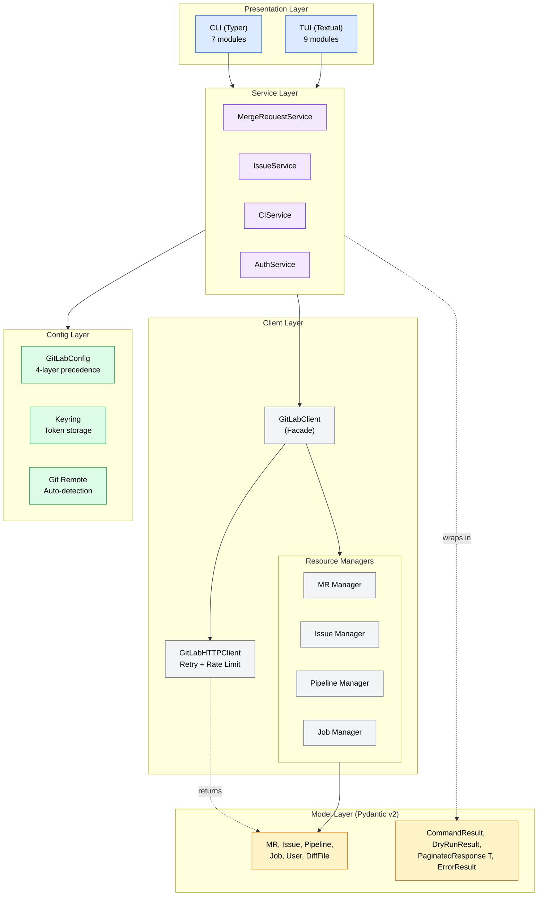
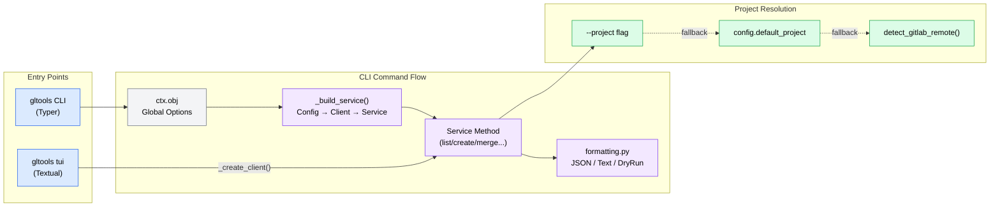
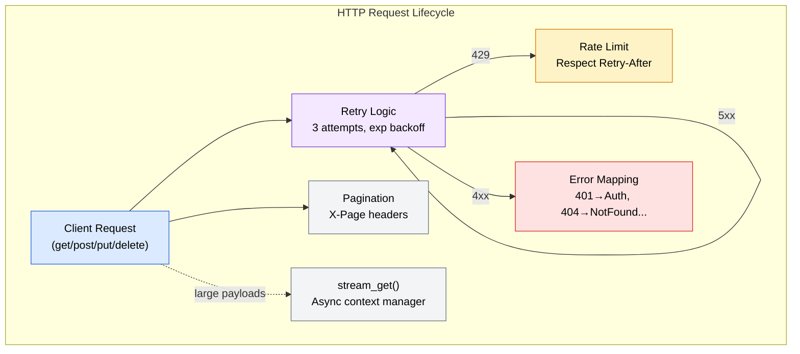

# Codebase Analysis Report

**Analysis Context**: General codebase understanding
**Codebase Path**: `/Users/sequenzia/dev/repos/gltools`
**Date**: 2026-03-06

## Table of Contents

- [Executive Summary](#executive-summary)
- [Architecture Overview](#architecture-overview)
- [Tech Stack](#tech-stack)
- [Critical Files](#critical-files)
- [Patterns & Conventions](#patterns--conventions)
- [Relationship Map](#relationship-map)
- [Challenges & Risks](#challenges--risks)
- [Recommendations](#recommendations)
- [Analysis Methodology](#analysis-methodology)

---

## Executive Summary

gltools is a well-architected Python CLI+TUI for GitLab with a clean 4-layer design (CLI/TUI → Services → Client/Managers → HTTP), modern Python 3.12+ idioms, and comprehensive test coverage (~957 tests). The primary risk is **inconsistency across resource domains** — the CI layer diverges from the MR/Issue pattern in project resolution, async wrapping, and error handling, while the TUI list screens remain unimplemented stubs despite a fully wired dashboard.

---

## Architecture Overview

gltools follows a **layered architecture** with clear separation of concerns. The HTTP layer (`GitLabHTTPClient`) handles authentication, retries with exponential backoff, and pagination header parsing. Four typed resource managers (`MergeRequestManager`, `IssueManager`, `PipelineManager`, `JobManager`) wrap specific API endpoints and return parsed Pydantic v2 models. A service layer orchestrates business logic — project resolution, dry-run support, and log streaming. Two independent presentation layers consume services: a Typer CLI optimized for agent/automation use (structured JSON output) and a Textual TUI for interactive human use.

The design philosophy prioritizes **forward compatibility** — Pydantic models use `extra="ignore"` so new API fields don't break parsing, and the plugin system allows third-party extensions via entry points.

---

## Tech Stack

| Category | Technology | Version | Role |
|----------|-----------|---------|------|
| Language | Python | 3.12+ | Primary language |
| CLI Framework | Typer | >=0.12.0 | CLI command routing |
| TUI Framework | Textual | >=0.80.0 | Terminal UI |
| HTTP Client | httpx | >=0.27.0 | Async HTTP requests |
| Data Models | Pydantic | v2 (>=2.0.0) | Model validation & serialization |
| Config | Pydantic Settings | >=2.0.0 | TOML config + env vars |
| Auth Storage | keyring | >=25.0.0 | Secure token storage |
| Output | Rich | >=13.0.0 | Terminal formatting |
| Build | Hatch (hatchling) | — | Package build |
| Package Manager | UV | — | Dependency management |
| Linter/Formatter | Ruff | — | Lint + format (py312 target, 120 line length) |
| Testing | pytest + pytest-asyncio + respx | — | Test runner + async + HTTP mocking |

---

## Critical Files

| File | Purpose | Relevance |
|------|---------|-----------|
| `src/gltools/cli/app.py` | Root Typer app, global options, `async_command` decorator, TUI launcher | High |
| `src/gltools/cli/formatting.py` | JSON/text output routing, Rich tables, dry-run display | High |
| `src/gltools/cli/mr.py` | 9 MR commands (list/view/create/merge/approve/diff/note/close/reopen/update) | High |
| `src/gltools/cli/ci.py` | 8 CI commands (status/list/run/retry/cancel/jobs/logs/artifacts) | High |
| `src/gltools/cli/issue.py` | 7 Issue commands (list/view/create/update/close/reopen/note) | High |
| `src/gltools/client/http.py` | Async HTTP client with retry, rate limiting, pagination, streaming | High |
| `src/gltools/client/gitlab.py` | Facade composing 4 resource managers | High |
| `src/gltools/client/exceptions.py` | 7-class exception hierarchy with `_mask_token()` | High |
| `src/gltools/config/settings.py` | `GitLabConfig` with 4-layer precedence, TOML profiles | High |
| `src/gltools/models/output.py` | Output envelopes: `PaginatedResponse[T]`, `CommandResult`, `DryRunResult`, `ErrorResult` | High |
| `src/gltools/services/merge_request.py` | MR business logic with 3-level project resolution, dry-run | High |
| `src/gltools/tui/app.py` | Main Textual app: screen routing, keybindings, auth gate | High |

### File Details

#### `src/gltools/cli/app.py`
- **Key exports**: `app` (root Typer), `async_command` decorator, subcommand Typer instances
- **Core logic**: Registers global options (`--json`, `--host`, `--token`, `--profile`, `--quiet`) into `ctx.obj`, mounts subcommand groups, provides `tui` command
- **Connections**: All CLI command modules register under this app; TUI launcher imports from `gltools.tui`

#### `src/gltools/client/http.py`
- **Key exports**: `GitLabHTTPClient`, `PaginationInfo`, `RetryConfig`
- **Core logic**: Async HTTP with retry (3 attempts, exponential backoff), 429 rate limit handling (Retry-After), pagination header parsing, `stream_get` context manager for large payloads
- **Connections**: Used by all resource managers via `GitLabClient` facade; consumed by all services

#### `src/gltools/config/settings.py`
- **Key exports**: `GitLabConfig`, profile loading, `from_config()` class method
- **Core logic**: 4-layer config precedence (CLI > env > TOML > defaults), profile system, env var clearing to prevent double-application by BaseSettings
- **Connections**: All services receive `GitLabConfig`; CLI modules create it in `_build_service()`

#### `src/gltools/models/output.py`
- **Key exports**: `PaginatedResponse[T]` (PEP 695 generic), `CommandResult`, `DryRunResult`, `ErrorResult`
- **Core logic**: Output envelope pattern — services wrap results in these types, `formatting.py` routes based on type
- **Connections**: All services return these types; `formatting.py` consumes them

---

## Patterns & Conventions

### Code Patterns
- **`async_command` decorator**: Bridges async service calls to sync Typer commands via `asyncio.run()`. Used by MR and Issue commands. CI commands use an alternate inline `asyncio.run(_run())` pattern.
- **`_build_service(ctx, project)` factory**: Each CLI module creates config → client → service from `ctx.obj`. Caller always does `finally: await client.close()`.
- **3-level project resolution**: `--project` flag → `config.default_project` → `detect_gitlab_remote()`. Used in MR/Issue services internally.
- **Dry-run pattern**: Service methods accept `dry_run: bool`, return `DryRunResult(method, url, body)` without API call. CLI routes output via `isinstance()` check.
- **Output envelopes**: All responses wrapped in `CommandResult`, `PaginatedResponse[T]`, or `ErrorResult`. `formatting.py` routes by `--json`/`--text` flag.
- **Manager pattern**: Takes `GitLabHTTPClient`, builds API paths with `_encode_project()`, returns Pydantic models via `model_validate(response.json())`.
- **Forward refs**: `PipelineRef` defined in `models/__init__.py` before `MergeRequest` import, then `MergeRequest.model_rebuild()` resolves string annotations.
- **TUI screen-as-widget**: Screens are `Widget` subclasses mounted into `#screen-container` Static slot, not Textual's native `Screen` stack.
- **TUI message-based navigation**: Custom `Message` subclasses (`MRSelected`, `ItemSelected`, etc.) for inter-widget communication.
- **TUI async workers**: `@work(exclusive=True)` and `run_worker()` for non-blocking service calls.

### Naming Conventions
- Module files: `snake_case.py`
- Classes: `PascalCase` (`MergeRequestService`, `GitLabHTTPClient`)
- Pydantic models: named after GitLab entities (`MergeRequest`, `Pipeline`, `Job`)
- CLI commands: kebab-case via Typer (e.g., `mr list`, `ci status`)
- Private methods: `_` prefix (`_resolve_project`, `_encode_project`)

### Project Structure
- `src/` layout with `src/gltools/` package
- Tests mirror source: `tests/test_cli/`, `tests/test_services/`, etc.
- Shared test fixtures in `tests/fixtures/responses.py` with factory functions and `_deep_merge()` overrides
- conftest.py provides `mock_router` (respx) and `http_client` fixtures

---

## Relationship Map

**CLI Command Flow:**

**HTTP Request Lifecycle:**

---

## Challenges & Risks

| Challenge | Severity | Impact |
|-----------|----------|--------|
| CI layer inconsistency | Medium | `CIService` takes `project_id` directly (resolved in CLI), unlike MR/Issue services which resolve internally. CI lacks `--project` flag and uses inline `asyncio.run()` instead of `@async_command`. Creates maintenance burden and confusion. |
| Duplicate code across modules | Medium | `_handle_gitlab_error()` near-identical in `mr.py` and `issue.py`. `_get_current_branch()` duplicated in `mr.py` and `services/ci.py`. `_encode_project()` duplicated in MR/Issue managers. Increases bug risk from inconsistent fixes. |
| TUI list screen stubs | Medium | `MRListScreen._load_data()` and `IssueListScreen._load_data()` collect filters but don't call services. Dashboard is fully wired but list/detail drill-down is incomplete. |
| `_encode_project` missing in Pipeline/Job managers | Low | Pipeline and Job managers pass `project_id` directly to f-strings without URL encoding. Breaks for namespace paths like `group/project`. |
| Auth formatting bypass | Low | `auth.py` builds JSON manually instead of using `formatting.py` helpers, creating inconsistent output structure. |
| Widget-as-screen TUI pattern | Low | Not using Textual's native `Screen` stack loses built-in back-navigation, screen history, and modal support. May require rework for complex flows. |
| Plugin TUI registration gap | Low | `register_tui_plugins()` exists but is never called from app startup. Plugins can only contribute CLI commands. |

---

## Recommendations

1. **Extract shared helpers across CLI modules** _(addresses: Duplicate code across modules)_: Move `_handle_gitlab_error()` to `formatting.py`, `_get_current_branch()` to `config/git_remote.py`, and `_encode_project()` to a shared utility used by all managers.

2. **Align CI service with MR/Issue pattern** _(addresses: CI layer inconsistency)_: Refactor `CIService` to accept `GitLabClient` + `GitLabConfig` and resolve project internally. Add `--project` flag to CI commands and use `@async_command` consistently.

3. **Wire TUI list screen data loading** _(addresses: TUI list screen stubs)_: Complete `MRListScreen._load_data()` and `IssueListScreen._load_data()` with service calls. The filter collection and table population interfaces are already in place.

4. **Fix `_encode_project` in Pipeline/Job managers** _(addresses: `_encode_project` missing in Pipeline/Job managers)_: Apply URL encoding consistently across all managers to handle namespace paths correctly.

5. **Standardize auth output** _(addresses: Auth formatting bypass)_: Refactor `auth.py` to use `formatting.py` helpers for consistent JSON/text output across all commands.

---

## Analysis Methodology

- **Exploration agents**: 3 agents — Focus 1: CLI+Services, Focus 2: Client+Models+Config, Focus 3: TUI+Plugins+Tests
- **Synthesis**: 1 synthesizer merged findings with git history and dependency analysis
- **Scope**: Full codebase including all source, tests, and configuration
- **Cache status**: Fresh analysis (2026-03-06)
- **Config files detected**: `pyproject.toml`
- **Gap-filling**: None needed — synthesis was comprehensive
