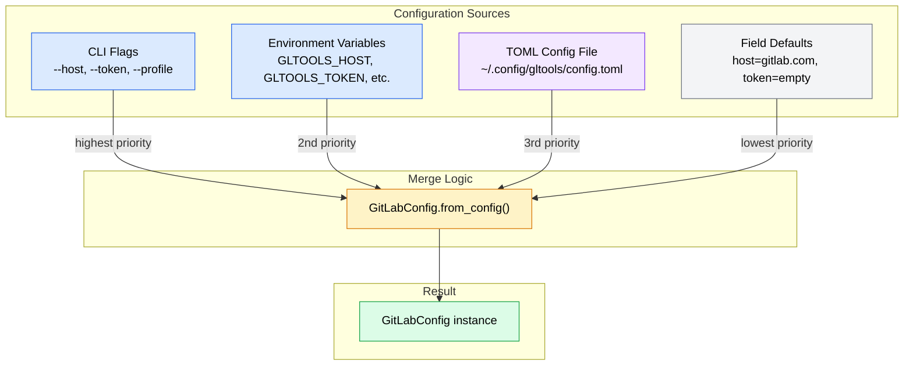
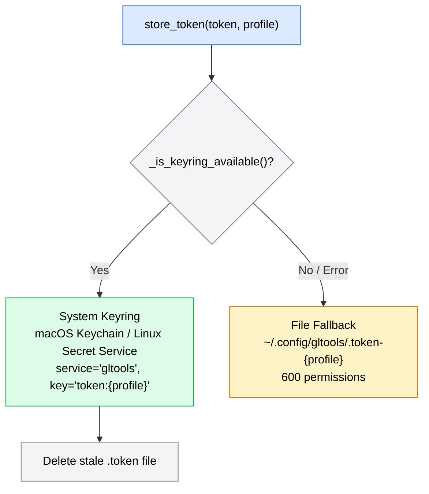
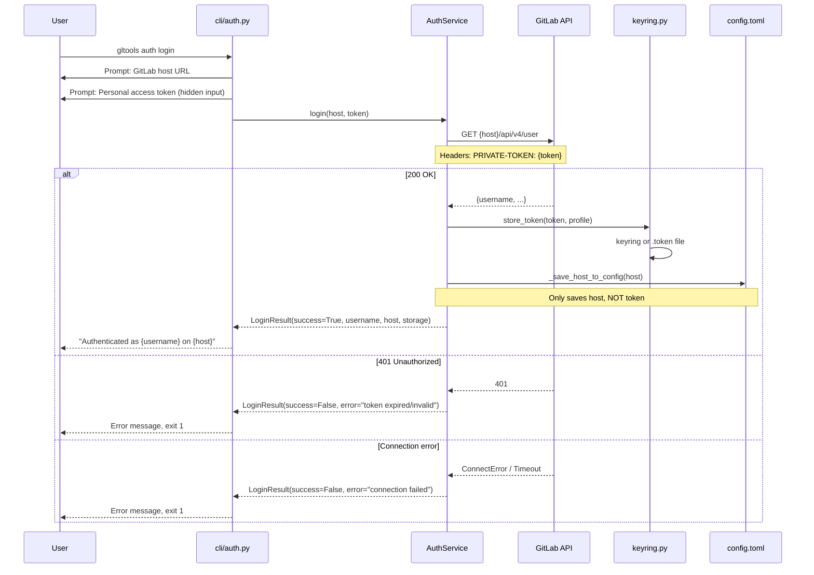

# Config Settings & GitLab Authentication Breakdown

**Date**: 2026-03-06
**Scope**: Full config precedence system, token storage, auth flow, and identified gaps

---

## Table of Contents

- [Config System Overview](#config-system-overview)
- [GitLabConfig Fields](#gitlabconfig-fields)
- [4-Layer Precedence System](#4-layer-precedence-system)
- [TOML Config File](#toml-config-file)
- [Profile System](#profile-system)
- [Token Storage (Keyring Module)](#token-storage-keyring-module)
- [Authentication Flow](#authentication-flow)
- [Token Flow Through the System](#token-flow-through-the-system)
- [Git Remote Detection](#git-remote-detection)
- [Security Measures](#security-measures)
- [Known Issues](#known-issues)

---

## Config System Overview

Configuration is managed by `GitLabConfig` (`src/gltools/config/settings.py`), a Pydantic `BaseSettings` subclass that merges values from 4 sources. Token storage is handled separately by the keyring module (`src/gltools/config/keyring.py`) to keep secrets out of the TOML config file.

### Architecture Diagram



---

## GitLabConfig Fields

| Field | Type | Default | Env Var | CLI Flag | Description |
|-------|------|---------|---------|----------|-------------|
| `host` | `str` | `"https://gitlab.com"` | `GLTOOLS_HOST` | `--host` | GitLab instance URL |
| `token` | `str` | `""` (empty) | `GLTOOLS_TOKEN` | `--token` | GitLab Personal Access Token |
| `default_project` | `str \| None` | `None` | `GLTOOLS_DEFAULT_PROJECT` | — | Default project path (e.g., `group/project`) |
| `output_format` | `str` | `"text"` | `GLTOOLS_OUTPUT_FORMAT` | `--json` / `--text` | Output format, validated to `"json"` or `"text"` |
| `profile` | `str` | `"default"` | `GLTOOLS_PROFILE` | `--profile` | Configuration profile name |

### Validation Rules

- `output_format` must be `"json"` or `"text"` — enforced by `@field_validator`
- `model_config` uses `extra="ignore"` — unknown fields in TOML are silently dropped
- `env_prefix` is `"GLTOOLS_"` — all env vars are prefixed

---

## 4-Layer Precedence System

`GitLabConfig.from_config()` (`settings.py:146-222`) implements explicit 3-layer merging (plus defaults handled by Pydantic):

### Step-by-Step Merge Process

1. **Determine effective profile**:
   - Check `cli_overrides["profile"]` first
   - Then `profile` parameter
   - Then `GLTOOLS_PROFILE` env var
   - Default: `"default"`

2. **Layer 3 — TOML file values**:
   - Call `load_profile_from_toml(config_path, profile, strict=...)`
   - `strict=True` when profile is explicitly named (not `"default"`) — raises `ProfileNotFoundError` if missing
   - Returns only string/None values from the profile section
   - Adds `profile` key to the dict

3. **Layer 2 — Environment variables**:
   - Scans `os.environ` for `GLTOOLS_{FIELD_NAME}` for each model field
   - Collects found values into `env_values` dict

4. **Layer 1 — CLI overrides**:
   - Filters out `None` values (unset flags) from `cli_overrides`

5. **Merge** (later updates win):
   ```python
   merged = {}
   merged.update(file_values)   # TOML
   merged.update(env_values)    # env vars override TOML
   merged.update(active_cli)    # CLI flags override everything
   ```

6. **Env var workaround**:
   - Temporarily removes all `GLTOOLS_*` from `os.environ`
   - Constructs `GitLabConfig(**merged)` — prevents `BaseSettings.__init__` from re-reading env vars
   - Restores env vars in `finally` block

### Precedence Example

Given:
- TOML: `host = "https://gitlab.internal.com"`, `token = "file-token"`
- Env: `GLTOOLS_HOST=https://env-gitlab.com`
- CLI: `--token my-cli-token`

Result:
- `host` = `"https://env-gitlab.com"` (env overrides TOML)
- `token` = `"my-cli-token"` (CLI overrides env)
- Everything else from TOML or defaults

---

## TOML Config File

**Location**: `~/.config/gltools/config.toml` (XDG-compliant, respects `XDG_CONFIG_HOME`)

### File Structure

```toml
[profiles.default]
host = "https://gitlab.com"

[profiles.work]
host = "https://gitlab.example.com"
default_project = "team/backend"

[profiles.personal]
host = "https://gitlab.com"
default_project = "myuser/myproject"
```

### Key Behaviors

- **`load_profile_from_toml()`** returns only values where `isinstance(v, str | None)` — filters out non-string values for forward compatibility
- **`list_profiles()`** returns sorted profile names; returns empty list if file doesn't exist or has invalid TOML
- **`write_config()`** writes with 600 permissions (`stat.S_IRUSR | stat.S_IWUSR`)
- **`_dict_to_toml()`** is a simple serializer supporting nested tables (used by `AuthService._save_host_to_config()`)

### Config Directory Resolution

```python
def get_config_dir() -> Path:
    xdg_config = os.environ.get("XDG_CONFIG_HOME")
    if xdg_config:
        return Path(xdg_config) / "gltools"
    return Path.home() / ".config" / "gltools"
```

---

## Profile System

Profiles are named configuration sets within the TOML file, allowing multiple GitLab instances or project contexts.

### Profile Selection Precedence

1. `--profile` CLI flag
2. `GLTOOLS_PROFILE` env var
3. Default: `"default"`

### Strict vs Lenient Mode

- **Strict** (explicit profile requested): If the profile doesn't exist but other profiles do, raises `ProfileNotFoundError` with available profile names
- **Lenient** (default profile): Returns empty dict silently if profile doesn't exist

### Listing Profiles

`list_profiles()` reads the TOML file and returns `sorted(profiles.keys())`. Used by the CLI but not exposed as a dedicated command.

---

## Token Storage (Keyring Module)

`src/gltools/config/keyring.py` manages GitLab PAT storage with a 2-tier strategy.

### Storage Architecture



### Keyring Availability Check

```python
def _is_keyring_available() -> bool:
    backend = keyring.get_keyring()
    backend_name = type(backend).__name__
    return "fail" not in backend_name.lower() and "null" not in backend_name.lower()
```

Rejects backends like `FailKeyring` or `NullKeyring` that indicate no usable keyring.

### Token Operations

| Operation | Function | Keyring Key | Fallback |
|-----------|----------|-------------|----------|
| Store | `store_token(token, profile)` | `set_password("gltools", "token:{profile}", token)` | Write `.token-{profile}` file |
| Retrieve | `get_token(profile)` | `get_password("gltools", "token:{profile}")` | Read `.token-{profile}` file |
| Delete | `delete_token(profile)` | `delete_password("gltools", "token:{profile}")` | Delete `.token-{profile}` file |

### Error Handling

All keyring operations catch `KeyringError`, `NoKeyringError`, and generic `Exception`. On failure:
- **Store**: Falls back to file storage with warning log
- **Retrieve**: Falls back to file read with warning log
- **Delete**: Attempts file deletion regardless of keyring result

### File Fallback Details

- Path: `~/.config/gltools/.token-{profile}` (dotfile, hidden)
- Permissions: `600` (`S_IRUSR | S_IWUSR`) on write
- On read: warns if permissions aren't 600
- Content: raw token string, stripped on read

---

## Authentication Flow

`AuthService` (`src/gltools/services/auth.py`) orchestrates login, status checks, and logout.

### Login Flow



### Token Validation

`AuthService.validate_token()` makes a direct `GET /api/v4/user` call using a standalone `httpx.AsyncClient` (not the project's `GitLabHTTPClient`):
- Timeout: 15 seconds
- Auth header: `PRIVATE-TOKEN: {token}`
- Returns user data dict on 200, `None` on 401
- Raises `ConnectionError` on network issues

### Status Check Flow

`auth status` calls `AuthService.get_status()`:
1. Load profile data from TOML (for host)
2. Call `get_token(profile)` from keyring module
3. If no token: return `AuthStatus(authenticated=False)`
4. If token exists and host known: re-validate via `GET /api/v4/user`
5. Report: authenticated, host, username, token validity, storage type

### Logout

`AuthService.logout()` calls `delete_token(profile)` which removes from both keyring and file storage.

---

## Token Flow Through the System

### How Tokens Reach the HTTP Client

The `GitLabHTTPClient` sends all requests with a `PRIVATE-TOKEN` header:

```python
# client/http.py:100-108
def _build_client(self) -> httpx.AsyncClient:
    return httpx.AsyncClient(
        base_url=self._base_url,
        headers={
            "PRIVATE-TOKEN": self._token,
            "Accept": "application/json",
        },
        timeout=httpx.Timeout(self._timeout),
    )
```

### CLI Command Token Path

```
gltools mr list
    → app.py main() callback stores --token in ctx.obj["token"]
    → mr.py _build_service(ctx)
        → GitLabConfig.from_config(cli_overrides={"token": ctx.obj["token"]})
            → Merges: TOML token → env GLTOOLS_TOKEN → CLI --token
            → Does NOT call get_token() from keyring
        → GitLabClient(host=config.host, token=config.token)
            → GitLabHTTPClient sets PRIVATE-TOKEN header
```

### TUI Token Path (different — includes keyring fallback)

```
tui/app.py on_mount():
    token = self._config.token or get_token(profile=self._config.profile)
    #                              ^^^^^^^^^ keyring fallback!

tui/screens/dashboard.py _build_client():
    token = self._config.token or get_token(profile=self._config.profile)
    #                              ^^^^^^^^^ keyring fallback!
```

### The Gap

| Entry Point | Reads from TOML/Env/CLI | Reads from Keyring | Works after `auth login` |
|-------------|------------------------|-------------------|------------------------|
| `gltools mr list` | Yes | **No** | Only if `GLTOOLS_TOKEN` set or `--token` passed |
| `gltools issue list` | Yes | **No** | Only if `GLTOOLS_TOKEN` set or `--token` passed |
| `gltools ci status` | Yes | **No** | Only if `GLTOOLS_TOKEN` set or `--token` passed |
| `gltools auth status` | Yes | **Yes** | Yes |
| `gltools tui` | Yes | **Yes** | Yes |

---

## Git Remote Detection

`config/git_remote.py` provides automatic project path and host detection from git remotes.

### Supported URL Formats

| Format | Pattern | Example |
|--------|---------|---------|
| SSH | `git@{host}:{path}.git` | `git@gitlab.com:group/project.git` |
| HTTPS | `https://{host}/{path}.git` | `https://gitlab.com/group/project.git` |
| SSH protocol | `ssh://git@{host}/{path}.git` | `ssh://git@gitlab.com/group/project.git` |

All formats work with or without `.git` suffix.

### Detection Logic

1. Run `git remote -v` (5-second timeout)
2. Parse fetch URLs for each remote
3. Try preferred remote (`origin`) first
4. Fall back to other remotes
5. Return `GitRemoteInfo(host, project_path)` or `None`

### Usage in Services

`MergeRequestService._resolve_project()` uses this as the 3rd-level fallback:
1. Explicit `--project` parameter
2. `config.default_project` from TOML
3. `detect_gitlab_remote()` from git remotes

---

## Security Measures

### Token Protection

| Measure | Location | Details |
|---------|----------|---------|
| Keyring storage | `config/keyring.py` | Prefers OS keyring over plaintext files |
| File permissions | `keyring.py`, `settings.py` | 600 permissions on token files and config |
| Token masking in logs | `client/exceptions.py` | `_mask_token()` scrubs `PRIVATE-TOKEN`, `Bearer`, and `glpat-*` patterns |
| Safe logging wrapper | `client/http.py:130` | `_safe_log()` applies masking to all log output |
| Hidden input | `cli/auth.py:53` | `typer.prompt(hide_input=True)` for token entry |
| Exception masking | `client/exceptions.py:23` | `GitLabClientError.__init__` applies `_mask_token()` to all error messages |

### Token Masking Patterns

```python
# PRIVATE-TOKEN header values
re.sub(r"(PRIVATE-TOKEN[:\s]+)\S+", r"\1[MASKED]", text)

# Bearer tokens
re.sub(r"(Authorization[:\s]+Bearer\s+)\S+", r"\1[MASKED]", text)

# glpat- prefixed tokens anywhere
re.sub(r"glpat-\S+", "[MASKED]", text)
```

---

## Known Issues

### 1. CLI Commands Cannot Access Keyring-Stored Tokens (High Severity)

**Problem**: `GitLabConfig.from_config()` does not call `get_token()` from the keyring module. After `gltools auth login` stores a token in the keyring, CLI commands like `gltools mr list` will have an empty token and fail with 401.

**Root cause**: The `_build_service()` factory in `mr.py`, `issue.py`, and `ci.py` builds config via `from_config()` and passes `config.token` directly to `GitLabClient`. There is no keyring fallback in this path.

**Workaround**: Users must set `GLTOOLS_TOKEN` environment variable or pass `--token` on every command.

**Fix**: Add keyring fallback to `from_config()`:
```python
# At the end of from_config(), before constructing:
if not merged.get("token"):
    from gltools.config.keyring import get_token
    keyring_token = get_token(profile=effective_profile)
    if keyring_token:
        merged["token"] = keyring_token
```

### 2. Env Var Pop/Restore Is Not Thread-Safe (Medium Severity)

**Problem**: `from_config()` temporarily removes `GLTOOLS_*` env vars from `os.environ` to prevent BaseSettings from double-reading them. This is not thread-safe.

**Impact**: Low in practice (CLI is single-threaded), but could cause issues if the config system is used in concurrent contexts.

### 3. Auth Login Uses Separate HTTP Client (Low Severity)

**Problem**: `AuthService.validate_token()` creates its own `httpx.AsyncClient` instead of using `GitLabHTTPClient`. This means it doesn't benefit from the retry logic, rate limiting, or error classification in the main HTTP client.

**Impact**: Token validation has a simpler error handling path (catches 3 exception types) compared to the main client (handles 7+ error types with retries).
