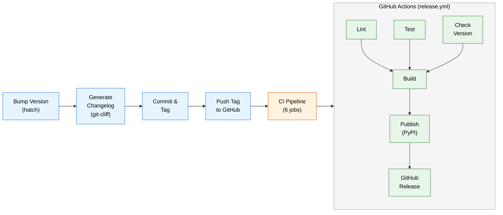

# Release Process

Consolidated reference for the gltools release pipeline — from local version bump through PyPI publication and GitHub Release creation.

## Overview



**Blue** = manual local steps. **Green** = automated CI jobs. Lint, Test, and Check Version run in parallel; Build waits for all three; Publish waits for Build; GitHub Release waits for Publish.

## Manual Release Steps

Run these from the repo root on the `main` branch.

### 1. Bump the version

```bash
hatch version <patch|minor|major>
```

This writes the new version string to `src/gltools/__init__.py` (the single source of truth).

### 2. Generate the changelog

```bash
git-cliff --tag "v$(hatch version)" -o CHANGELOG.md
```

git-cliff reads the git history since the last tag, groups commits by Conventional Commit type, and writes Keep a Changelog formatted output. The `--tag` flag tells git-cliff to label unreleased commits under the new version heading.

### 3. Commit the release

```bash
git add src/gltools/__init__.py CHANGELOG.md
git commit -m "chore(release): prepare v$(hatch version)"
```

The `chore(release)` prefix is important — git-cliff skips these commits so they don't appear in the changelog.

### 4. Tag the release

```bash
git tag "v$(hatch version)"
```

The tag must use the `v` prefix (e.g., `v0.2.0`). The CI pipeline triggers on tags matching `v*`.

### 5. Push

```bash
git push origin main
git push origin "v$(hatch version)"
```

Pushing the tag triggers the release workflow.

## Automated Pipeline

Defined in `.github/workflows/release.yml`. Triggers on any tag push matching `v*`.

### Job dependency graph

```
lint ─────────┐
test ─────────┼─→ build ─→ publish ─→ github-release
check-version ┘
```

### Job details

#### 1. Lint

- **Runs**: `ubuntu-latest`, Python 3.12
- **Does**: `uv sync --group dev` then `uv run ruff check src/ tests/`
- **Failure mode**: blocks the build if any lint violations exist

#### 2. Test

- **Runs**: `ubuntu-latest`, Python 3.12
- **Does**: `uv sync --group dev` then `uv run pytest`
- **Failure mode**: blocks the build if any test fails

#### 3. Check Version

- **Runs**: `ubuntu-latest`, Python 3.12
- **Does**: extracts the version from the git tag (`refs/tags/v` prefix stripped) and from `src/gltools/__init__.py` via regex, then compares them
- **Failure mode**: blocks the build with a descriptive error if the tag version doesn't match `__version__`
- **Error output includes**: both version values and instructions to fix (update `__init__.py` or recreate the tag)

#### 4. Build

- **Depends on**: lint, test, check-version (all must pass)
- **Does**: `uv run hatch build` to produce sdist (`.tar.gz`) and wheel (`.whl`) in `dist/`
- **Artifacts**: uploaded via `actions/upload-artifact@v4` as the `dist` artifact
- **Failure mode**: build errors prevent publish

#### 5. Publish to PyPI

- **Depends on**: build
- **Environment**: `pypi` (GitHub environment — can have approval gates)
- **Permissions**: `id-token: write` (required for OIDC)
- **Does**:
  1. Downloads the `dist` artifact
  2. Verifies both `.tar.gz` and `.whl` files exist
  3. Publishes via `pypa/gh-action-pypi-publish@release/v1` using Trusted Publisher OIDC
- **Failure mode**: fails if artifacts are missing, OIDC auth fails, or version already exists on PyPI

#### 6. GitHub Release

- **Depends on**: publish
- **Permissions**: `contents: write`
- **Does**:
  1. Checks out the repo with full history (`fetch-depth: 0`)
  2. Downloads the `dist` artifact
  3. Extracts the changelog section for this version from `CHANGELOG.md` (using `sed` to capture between version headers)
  4. Builds a diff link comparing the current tag to the previous tag (by version sort)
  5. Composes the release body: changelog excerpt + separator + "Full Changelog" diff link
  6. Creates the release via `softprops/action-gh-release@v2` with the dist files attached
- **Fallback**: if no changelog section is found, falls back to GitHub's auto-generated release notes
- **First release**: if no previous tag exists, the diff link points to all commits up to the tag

## Changelog Generation

### How git-cliff works

1. Reads git history and parses Conventional Commit messages
2. Groups commits by type into Keep a Changelog sections
3. Formats each entry as `- **scope**: message` (scope omitted if absent)
4. Strips issue numbers from commit messages via regex preprocessor
5. Sorts commits within sections by oldest first

### Commit type → changelog section mapping

| Commit Prefix | Changelog Section |
|---|---|
| `feat` | Added |
| `fix` | Fixed |
| `doc` / `docs` | Documentation |
| `perf` | Performance |
| `refactor` | Changed |
| `style` | Changed |
| `test` | Testing |
| `chore` / `ci` | Miscellaneous |
| `revert` | Reverted |
| Non-conventional | Other |

### Skipped commits

| Pattern | Reason |
|---|---|
| `chore(release)` | Release prep commits (version bump + changelog) |
| `Merge` | Merge commits |

### Configuration

All changelog settings live in `cliff.toml`. Key options:

- `conventional_commits = true` — parse commit types
- `filter_unconventional = false` — non-conventional commits are kept (under "Other")
- `tag_pattern = "v[0-9].*"` — only `v`-prefixed semver tags create version sections
- `sort_commits = "oldest"` — chronological order within sections

## Version Management

### Source of truth

The version lives in `src/gltools/__init__.py` as the `__version__` variable:

```python
__version__ = "0.1.3"
```

Hatch reads this file at build time, configured in `pyproject.toml`:

```toml
[project]
dynamic = ["version"]

[tool.hatch.version]
path = "src/gltools/__init__.py"
```

### Semantic versioning

| Bump | When | Example |
|---|---|---|
| `major` | Breaking CLI or API changes | `0.1.3 → 1.0.0` |
| `minor` | New backward-compatible features | `0.1.3 → 0.2.0` |
| `patch` | Bug fixes, minor improvements | `0.1.3 → 0.1.4` |

### Commands

```bash
hatch version          # Show current version
hatch version patch    # Bump patch
hatch version minor    # Bump minor
hatch version major    # Bump major
hatch version "1.0.0"  # Set explicit version
```

## PyPI Trusted Publisher Setup

This is a one-time configuration. Once set up, no API tokens or secrets are needed — GitHub Actions authenticates with PyPI via OpenID Connect.

### PyPI side

1. Log in at https://pypi.org/manage/account/publishing/
2. Add a pending publisher (or go to the project's Publishing settings if it already exists)
3. Fill in the form:
   - **PyPI project name**: `gltools`
   - **Owner**: `sequenzia`
   - **Repository name**: `gltools`
   - **Workflow name**: `release.yml`
   - **Environment name**: `pypi`
4. Save

### GitHub side

1. Go to repo **Settings > Environments**
2. Create an environment named `pypi`
3. (Optional) Add required reviewers for manual approval before publishing
4. (Optional) Restrict deployment to the `main` branch via deployment branch rules

All four fields (owner, repo, workflow, environment) must match exactly between PyPI and GitHub for OIDC to work.

## Troubleshooting

### Version mismatch (check-version failure)

**Symptom**: CI fails at the "Check tag-version consistency" job with `Version mismatch: git tag 'vX.Y.Z' does not match __version__ 'A.B.C'`.

**Cause**: The tag was created before bumping `__version__`, or `__init__.py` was edited without updating the tag.

**Fix** (option A — update the code):
```bash
# Update __init__.py to match the tag
hatch version "X.Y.Z"
git add src/gltools/__init__.py
git commit -m "chore(release): fix version to vX.Y.Z"
git push origin main
# Delete and recreate the tag
git tag -d vX.Y.Z
git push origin :refs/tags/vX.Y.Z
git tag vX.Y.Z
git push origin vX.Y.Z
```

**Fix** (option B — recreate the tag):
```bash
# Delete the wrong tag and create one matching __version__
git tag -d vX.Y.Z
git push origin :refs/tags/vX.Y.Z
git tag "v$(hatch version)"
git push origin "v$(hatch version)"
```

### Duplicate version on PyPI

**Symptom**: Publish job fails with HTTP 400 — `File already exists`.

**Cause**: PyPI does not allow overwriting published versions.

**Fix**: Bump to the next patch version and release again:
```bash
hatch version patch
git-cliff --tag "v$(hatch version)" -o CHANGELOG.md
git add src/gltools/__init__.py CHANGELOG.md
git commit -m "chore(release): prepare v$(hatch version)"
git tag "v$(hatch version)"
git push origin main
git push origin "v$(hatch version)"
```

### OIDC authentication failure

**Symptom**: Publish job fails with an OIDC token exchange error.

**Cause**: Trusted Publisher configuration mismatch between PyPI and GitHub.

**Fix**: Verify all fields match exactly:
- Owner: `sequenzia`
- Repository: `gltools`
- Workflow: `release.yml`
- Environment: `pypi`

Check that the `pypi` GitHub environment exists under repo Settings > Environments.

### Missing changelog section in GitHub Release

**Symptom**: GitHub Release uses auto-generated notes instead of changelog content.

**Cause**: `CHANGELOG.md` doesn't contain a section header matching the released version (e.g., `## [0.2.0]`).

**Fix**: Ensure step 2 (changelog generation) was run with the correct `--tag` value before committing. The version in the changelog header must match the tag (without the `v` prefix).

### Build artifacts missing

**Symptom**: Publish job fails with `No build artifacts found in dist/ directory`.

**Cause**: The build job failed silently or the artifact upload didn't complete.

**Fix**: Check the Build job logs for errors. Re-run the workflow from the Actions tab if it was a transient failure.

## Quick Reference

Copy-paste block for a standard release:

```bash
# 1. Bump version
hatch version patch  # or minor, major

# 2. Generate changelog
git-cliff --tag "v$(hatch version)" -o CHANGELOG.md

# 3. Commit
git add src/gltools/__init__.py CHANGELOG.md
git commit -m "chore(release): prepare v$(hatch version)"

# 4. Tag
git tag "v$(hatch version)"

# 5. Push (triggers CI)
git push origin main
git push origin "v$(hatch version)"
```

After pushing, monitor the release pipeline at: `https://github.com/sequenzia/gltools/actions`
