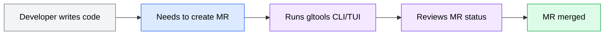
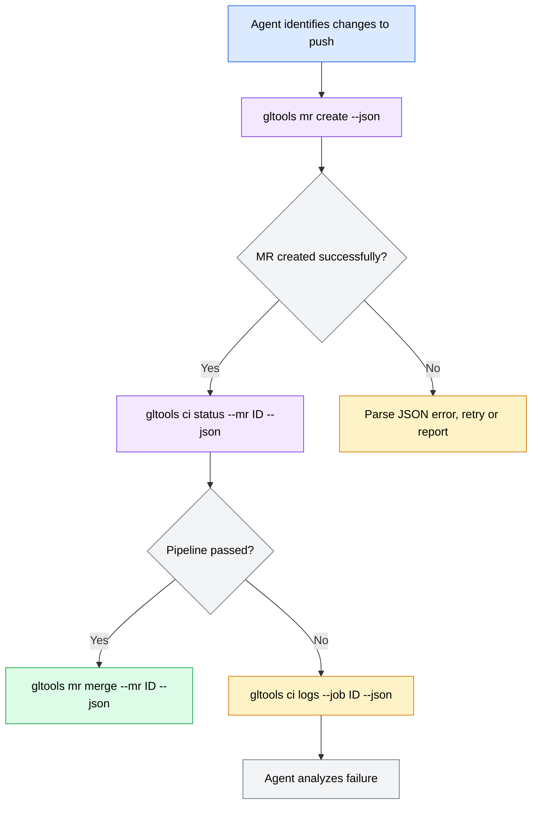
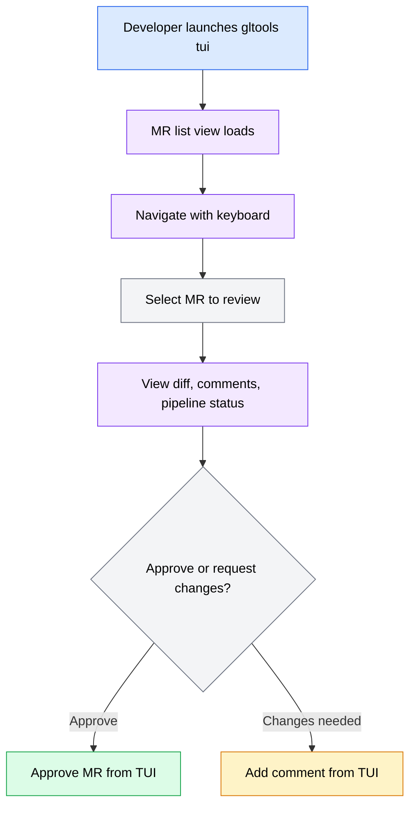
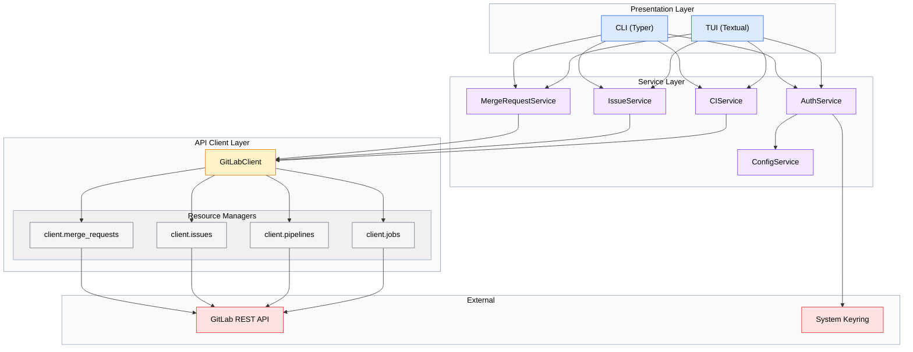
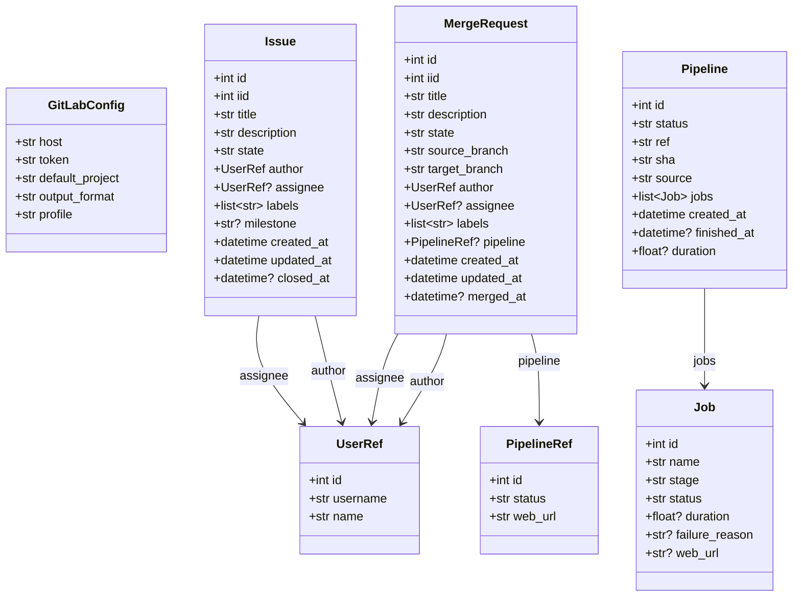
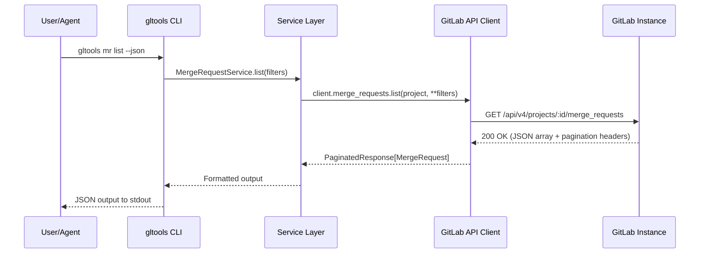

# gltools PRD

**Version**: 1.0
**Author**: Stephen Sequenzia
**Date**: 2026-03-05
**Status**: Draft
**Spec Type**: New Product
**Spec Depth**: Full Technical Documentation
**Description**: A Python-based CLI and TUI for interacting with GitLab repositories, issues, merge requests, and CI/CD pipelines. The CLI is optimized for coding agents while the TUI is optimized for human users.

---

## 1. Executive Summary

gltools is a Python-native CLI and TUI toolset for GitLab that serves both coding agents and human developers. It provides a unified, extensible interface to GitLab's REST API, with the CLI optimized for machine-readable output and the TUI optimized for interactive use. Both interfaces share a common service layer to ensure consistent behavior and reduce code duplication.

## 2. Problem Statement

### 2.1 The Problem

Developers and coding agents working with GitLab lack a Python-native, agent-friendly CLI tool. The existing `glab` CLI (written in Go) is designed exclusively for human interaction, producing output that is difficult for coding agents to parse reliably. Meanwhile, the `python-gitlab` library provides API access but no CLI or TUI interface, and direct API calls via curl/httpie are verbose and error-prone.

### 2.2 Current State

Users currently rely on a fragmented set of tools:
- **glab CLI**: Human-oriented, not designed for machine parsing, not extensible within the Python ecosystem
- **python-gitlab**: Python API wrapper but no CLI/TUI — requires writing scripts for every interaction
- **Direct API calls**: Verbose, requires manual authentication handling, no pagination support
- **GitLab web UI**: Full-featured but requires context-switching away from the terminal

### 2.3 Impact Analysis

- **Agent workflows**: Coding agents cannot reliably interact with GitLab without custom API integration code, increasing development time for every agent-based workflow
- **Developer productivity**: Context-switching between terminal and browser for GitLab operations breaks flow state
- **Ecosystem fragmentation**: Teams maintain multiple scripts and wrappers for GitLab interactions, leading to inconsistent behavior and duplicated effort

### 2.4 Business Value

- Enables coding agents to interact with GitLab as a first-class capability, unlocking automated MR workflows, issue triage, and CI/CD management
- Provides a single, well-maintained Python package that replaces ad-hoc scripts and multiple tool dependencies
- Positions gltools as the standard Python-native GitLab CLI, filling a clear gap in the ecosystem

## 3. Goals & Success Metrics

### 3.1 Primary Goals

1. Provide CLI coverage for the most common 80% of GitLab operations (MRs, Issues, CI/CD)
2. Enable at least one coding agent to use gltools as its GitLab interface
3. Deliver a TUI that provides an intuitive interactive experience for human developers
4. Support both public GitLab (gitlab.com) and self-hosted enterprise instances

### 3.2 Success Metrics

| Metric | Current Baseline | Target | Measurement Method |
|--------|------------------|--------|-------------------|
| CLI command coverage | 0 commands | Full MR, Issue, CI/CD command groups | Feature checklist |
| Agent compatibility | No structured output | All commands support JSON output | Integration test with agent |
| Multi-instance support | N/A | Works with gitlab.com + 1 self-hosted | Manual test |
| Test coverage | 0% | >= 80% | pytest-cov |

### 3.3 Non-Goals

- Full feature parity with glab at MVP (repo commands, snippet commands, etc. are deferred)
- GraphQL API support (REST API only for MVP)
- Web-based interface or browser extension
- GitLab admin/system administration commands
- Git operations (clone, push, pull) — gltools focuses on GitLab API operations

## 4. User Research

### 4.1 Target Users

#### Primary Persona: Coding Agent

- **Role/Description**: An AI coding agent (e.g., Claude Code, Cursor, Copilot) that interacts with GitLab programmatically
- **Goals**: Create and manage MRs, read and update issues, check CI/CD status, retrieve pipeline logs
- **Pain Points**: Unstructured CLI output is unparseable; no Python-native tool available; error messages are ambiguous
- **Context**: Runs in a terminal/shell environment, processes output programmatically
- **Technical Proficiency**: High — needs structured data, predictable exit codes, and machine-readable errors

#### Secondary Persona: Human Developer

- **Role/Description**: A developer who prefers terminal-based workflows over the GitLab web UI
- **Goals**: Quickly review MRs, check pipeline status, manage issues without leaving the terminal
- **Pain Points**: Context-switching to browser; glab doesn't support self-hosted instances well; wants a richer TUI experience
- **Context**: Works in terminal alongside editor/IDE, wants keyboard-driven interaction
- **Technical Proficiency**: Medium to high — comfortable with CLI tools, values good UX

### 4.2 User Journey Map



### 4.3 User Workflows

#### Workflow 1: Agent Creates and Monitors a Merge Request



#### Workflow 2: Developer Reviews MRs in TUI



## 5. Functional Requirements

### 5.1 Feature: Configuration & Authentication

**Priority**: P0 (Critical)
**Complexity**: Medium

#### User Stories

**US-001**: As a user, I want to configure gltools with my GitLab instance URL and personal access token so that I can authenticate with the API.

**Acceptance Criteria**:
- [ ] Config file stored at `~/.config/gltools/config.toml` (XDG-compliant)
- [ ] Supports multiple named profiles (e.g., `[profiles.work]`, `[profiles.personal]`)
- [ ] Token storage prefers system keyring (macOS Keychain, Linux Secret Service), falls back to config file with 600 permissions
- [ ] Environment variables (`GLTOOLS_TOKEN`, `GLTOOLS_HOST`) override config file values
- [ ] CLI flags (`--token`, `--host`, `--profile`) override environment variables
- [ ] Auto-detects GitLab instance from current git remote when no explicit host is specified
- [ ] `gltools auth login` interactive flow for initial setup
- [ ] `gltools auth status` shows current authentication state
- [ ] Global config setting for default output format (`output_format = "json" | "text"`)

**Technical Notes**:
- Use Pydantic Settings for config management with layered precedence
- TOML format for config file (Python 3.12+ has `tomllib` in stdlib)
- Use `keyring` library for system keyring integration

**Edge Cases**:
| Scenario | Input | Expected Behavior |
|----------|-------|-------------------|
| No config file exists | First run | Prompt user to run `gltools auth login` |
| Keyring unavailable | Linux without Secret Service | Fall back to config file storage with warning |
| Invalid token | Expired or revoked PAT | Clear error with instructions to re-authenticate |
| Multiple git remotes | Repo with `origin` and `upstream` | Use `origin` remote by default, configurable |

**Error Handling**:
| Error Condition | User Message | System Action |
|-----------------|--------------|---------------|
| No authentication configured | "Not authenticated. Run `gltools auth login` to set up." | Exit code 1 |
| Token expired | "Authentication failed: token may be expired. Run `gltools auth login` to refresh." | Exit code 1 |
| Keyring access denied | "Cannot access system keyring. Token will be stored in config file." | Fall back to file storage |

---

### 5.2 Feature: Merge Request Commands

**Priority**: P0 (Critical)
**Complexity**: High

#### User Stories

**US-002**: As a coding agent, I want to create merge requests with structured JSON output so that I can programmatically manage the MR lifecycle.

**US-003**: As a developer, I want to list, view, and manage merge requests from the terminal so that I don't need to switch to the browser.

**Acceptance Criteria**:
- [ ] `gltools mr create` — Create MR with title, description, source/target branch, labels, assignees
- [ ] `gltools mr list` — List MRs with filters (state, author, labels, scope, search)
- [ ] `gltools mr view <id>` — View MR details including description, diff stats, approvals, pipeline status
- [ ] `gltools mr merge <id>` — Merge an MR (with squash, delete-branch options)
- [ ] `gltools mr approve <id>` — Approve an MR
- [ ] `gltools mr diff <id>` — View MR diff
- [ ] `gltools mr note <id>` — Add a comment/note to an MR
- [ ] `gltools mr close <id>` — Close an MR without merging
- [ ] `gltools mr reopen <id>` — Reopen a closed MR
- [ ] `gltools mr update <id>` — Update MR properties (title, description, labels, assignees)
- [ ] All commands support `--json` flag for structured output
- [ ] All write commands support `--dry-run` flag
- [ ] `mr list` supports pagination with `--per-page` and `--all` flags
- [ ] Auto-detects project from current git remote

**Technical Notes**:
- Map to GitLab REST API: `GET/POST /projects/:id/merge_requests`
- Use async httpx for all API calls
- Pagination: auto-paginate up to 100 results by default, `--all` for complete results

**Edge Cases**:
| Scenario | Input | Expected Behavior |
|----------|-------|-------------------|
| MR already merged | `mr merge <id>` | Error: "MR !{id} is already merged" |
| MR has conflicts | `mr merge <id>` | Error: "MR !{id} has merge conflicts that must be resolved first" |
| No open MRs | `mr list` | Empty list (JSON: `[]`, text: "No open merge requests") |
| Large diff | `mr diff <id>` on 10k+ line diff | Stream output, don't load entirely into memory |

**Error Handling**:
| Error Condition | User Message | System Action |
|-----------------|--------------|---------------|
| MR not found | "Merge request !{id} not found in {project}" | Exit code 1 |
| Permission denied | "You don't have permission to merge !{id}" | Exit code 1 |
| Pipeline still running | "Pipeline is still running. Use --force to merge anyway." | Exit code 1 (unless --force) |

---

### 5.3 Feature: Issue Commands

**Priority**: P0 (Critical)
**Complexity**: Medium

#### User Stories

**US-004**: As a coding agent, I want to manage GitLab issues programmatically so that I can triage, update, and close issues as part of automated workflows.

**US-005**: As a developer, I want to quickly create and view issues from the terminal.

**Acceptance Criteria**:
- [ ] `gltools issue create` — Create issue with title, description, labels, assignee, milestone, due date
- [ ] `gltools issue list` — List issues with filters (state, labels, assignee, milestone, search, scope)
- [ ] `gltools issue view <id>` — View issue details with comments
- [ ] `gltools issue update <id>` — Update issue properties
- [ ] `gltools issue close <id>` — Close an issue
- [ ] `gltools issue reopen <id>` — Reopen a closed issue
- [ ] `gltools issue note <id>` — Add a comment to an issue
- [ ] All commands support `--json` flag for structured output
- [ ] All write commands support `--dry-run` flag
- [ ] `issue list` supports pagination with `--per-page` and `--all` flags

**Technical Notes**:
- Map to GitLab REST API: `GET/POST /projects/:id/issues`
- Reuse same pagination, output formatting, and error handling patterns as MR commands

**Edge Cases**:
| Scenario | Input | Expected Behavior |
|----------|-------|-------------------|
| Issue is confidential | `issue view <id>` without access | Error: "Issue #{id} not found" (don't leak existence) |
| Issue linked to MR | `issue close <id>` | Close issue, note linked MR in output |

---

### 5.4 Feature: CI/CD Commands

**Priority**: P0 (Critical)
**Complexity**: High

#### User Stories

**US-006**: As a coding agent, I want to check pipeline status and retrieve job logs so that I can react to CI failures programmatically.

**US-007**: As a developer, I want to trigger, monitor, and debug pipelines from the terminal.

**Acceptance Criteria**:
- [ ] `gltools ci status` — Show pipeline status for current branch (or specified MR/branch)
- [ ] `gltools ci list` — List pipelines with filters (status, ref, source)
- [ ] `gltools ci run` — Trigger a new pipeline for a branch
- [ ] `gltools ci retry <pipeline-id>` — Retry a failed pipeline
- [ ] `gltools ci cancel <pipeline-id>` — Cancel a running pipeline
- [ ] `gltools ci jobs <pipeline-id>` — List jobs in a pipeline
- [ ] `gltools ci logs <job-id>` — Retrieve job logs (stream or full)
- [ ] `gltools ci artifacts <job-id>` — Download job artifacts
- [ ] All commands support `--json` flag for structured output
- [ ] All write commands support `--dry-run` flag
- [ ] `ci status` includes job-level breakdown (stage, name, status, duration)

**Technical Notes**:
- Map to GitLab REST API: `GET/POST /projects/:id/pipelines`, `/projects/:id/jobs`
- Job logs can be large — stream with httpx async streaming
- Artifacts download should support writing to file or stdout

**Edge Cases**:
| Scenario | Input | Expected Behavior |
|----------|-------|-------------------|
| No pipelines for branch | `ci status` | "No pipelines found for branch '{branch}'" |
| Job log very large | `ci logs <id>` on 100MB log | Stream output, support `--tail N` for last N lines |
| Pipeline has manual jobs | `ci jobs <id>` | Show manual jobs with "manual" status, note they can be triggered |

---

### 5.5 Feature: Output Formatting

**Priority**: P0 (Critical)
**Complexity**: Medium

#### User Stories

**US-008**: As a coding agent, I want all CLI output in JSON format so that I can parse it reliably.

**US-009**: As a developer, I want human-readable formatted output with color and table layouts.

**Acceptance Criteria**:
- [ ] Global config setting `output_format` controls default (`json` or `text`)
- [ ] Per-command `--json` and `--text` flags override global setting
- [ ] JSON output: well-structured, consistent schema per command, includes metadata (pagination info, timestamps)
- [ ] Text output: formatted tables, colored status indicators, truncated long fields
- [ ] Error output follows the same format (JSON errors in JSON mode, human-readable in text mode)
- [ ] Exit codes are consistent: 0 for success, 1 for errors, 2 for usage errors
- [ ] `--quiet` flag suppresses all output except errors
- [ ] JSON output includes a top-level `status` field (`"success"` or `"error"`)

**Technical Notes**:
- Use Rich library for text formatting (tables, colors, markdown rendering)
- Define Pydantic models for all output schemas to ensure JSON consistency
- Output models should be separate from API response models (presentation layer separation)

---

### 5.6 Feature: Dry Run Mode

**Priority**: P1 (High)
**Complexity**: Low

#### User Stories

**US-010**: As a coding agent, I want to preview write operations before executing them so that I can validate actions before committing.

**Acceptance Criteria**:
- [ ] `--dry-run` flag available on all write commands (create, update, close, merge, approve, trigger)
- [ ] Dry run output shows: the API endpoint that would be called, the request body, and the HTTP method
- [ ] JSON mode: `{"dry_run": true, "method": "POST", "url": "...", "body": {...}}`
- [ ] Text mode: formatted preview with clear "DRY RUN" indicator
- [ ] Exit code 0 on successful dry run (action was valid but not executed)

---

### 5.7 Feature: Plugin System

**Priority**: P2 (Medium)
**Complexity**: Medium

#### User Stories

**US-011**: As a developer, I want to extend gltools with custom commands so that I can add organization-specific workflows.

**Acceptance Criteria**:
- [ ] `GLToolsPlugin` protocol class defines the extension interface
- [ ] Plugins can register new CLI commands and TUI views
- [ ] Plugin discovery via Python entry points (`gltools.plugins` group)
- [ ] Plugins have access to the authenticated GitLab client and config
- [ ] `gltools plugin list` shows installed plugins
- [ ] Plugin loading errors are handled gracefully (warning, not crash)

**Technical Notes**:
- Use Python `importlib.metadata.entry_points()` for plugin discovery
- Define a minimal `GLToolsPlugin` protocol:
  ```python
  class GLToolsPlugin(Protocol):
      name: str
      version: str
      def register_commands(self, app: typer.Typer) -> None: ...
      def register_tui_views(self, app: textual.App) -> None: ...
  ```
- Keep the plugin API surface small for MVP — expand based on actual extension needs

---

### 5.8 Feature: TUI Application

**Priority**: P1 (High)
**Complexity**: High

#### User Stories

**US-012**: As a developer, I want an interactive TUI for browsing and managing GitLab resources with keyboard navigation.

**Acceptance Criteria**:
- [ ] `gltools tui` launches the Textual-based TUI application
- [ ] Dashboard view showing recent MRs, issues, and pipeline status
- [ ] MR list view with filtering, sorting, and detail panel
- [ ] Issue list view with filtering, sorting, and detail panel
- [ ] Pipeline/CI view showing pipeline status and job breakdown
- [ ] MR detail view with diff viewer, comments, and action buttons (approve, merge, comment)
- [ ] Keyboard-driven navigation (vim-style bindings optional)
- [ ] Command palette for quick actions (Ctrl+P or similar)
- [ ] Respects the same config and authentication as the CLI
- [ ] Async data loading with loading indicators

**Technical Notes**:
- Built on Textual framework (async-native, works well with httpx async client)
- Reuse service layer — TUI calls the same services as CLI
- Use Textual's built-in widgets: DataTable, Tree, TextArea, Header, Footer
- Consider lazy loading for large lists

---

## 6. Non-Functional Requirements

### 6.1 Performance Requirements

| Metric | Requirement | Measurement Method |
|--------|-------------|-------------------|
| CLI command startup | < 500ms (excluding network) | Time from invocation to first API call |
| API response display | < 200ms after API returns | Profiling |
| TUI initial load | < 2s to interactive state | Manual timing |
| Large list rendering | Handle 1000+ items without lag | Stress test with pagination |

### 6.2 Security Requirements

#### Authentication
- Personal access tokens (PAT) are the only supported auth method for MVP
- Tokens are stored in system keyring when available, config file with 600 permissions as fallback
- Tokens are never logged, printed, or included in error output
- Config file containing tokens must not be committed to git (`.gitignore` template provided)

#### Data Protection
- All GitLab API communication over HTTPS (TLS 1.2+)
- No local data storage beyond configuration (no caching)
- Token masking in debug/verbose output

### 6.3 Compatibility Requirements

- Python 3.12 or later
- macOS, Linux (primary targets)
- Windows (best-effort, not blocked)
- GitLab CE/EE 15.0+ (REST API v4)
- Works with gitlab.com and self-hosted instances

### 6.4 Accessibility Requirements

- TUI supports keyboard-only navigation
- TUI uses semantic colors (not color-only indicators) for status
- CLI text output works with screen readers

## 7. Technical Architecture

### 7.1 System Overview



### 7.2 Tech Stack

| Layer | Technology | Justification |
|-------|------------|---------------|
| CLI Framework | Typer | Type-hint driven CLI with auto-generated help, rich output support |
| TUI Framework | Textual | Modern async TUI framework for Python, rich widget library |
| HTTP Client | httpx | Async-native HTTP client, drop-in replacement for requests |
| Data Validation | Pydantic v2 | Fast validation, serialization, and settings management |
| Config Management | Pydantic Settings + tomllib | Layered config with type validation |
| Token Storage | keyring | Cross-platform keyring access (macOS Keychain, Linux Secret Service) |
| Text Formatting | Rich | Terminal formatting, tables, syntax highlighting (shared with Textual) |
| Testing | pytest + respx + pytest-asyncio | Async test support with httpx-native mocking |
| Packaging | Hatch | Modern Python build system with environment management |
| Dependency Mgmt | UV | Fast Python package manager |

### 7.3 Data Models

#### Core Pydantic Models



**Model Configuration**:
All models use permissive parsing to handle GitLab API version differences:
```python
class BaseGitLabModel(BaseModel):
    model_config = ConfigDict(extra="ignore", populate_by_name=True)
```

### 7.4 API Client Specifications

The GitLab API client provides a typed, fluent interface for all GitLab REST API operations.

#### Client Architecture

```python
class GitLabClient:
    """Typed GitLab REST API client with resource managers."""
    merge_requests: MergeRequestManager
    issues: IssueManager
    pipelines: PipelineManager
    jobs: JobManager
```

#### Resource Manager Interface

Each resource manager follows the same pattern:

```python
class MergeRequestManager:
    async def list(
        self, project_id: int | str, *,
        state: str | None = None,
        labels: list[str] | None = None,
        author_username: str | None = None,
        scope: str | None = None,
        search: str | None = None,
        per_page: int = 20,
        page: int = 1,
    ) -> PaginatedResponse[MergeRequest]: ...

    async def get(self, project_id: int | str, mr_iid: int) -> MergeRequest: ...

    async def create(
        self, project_id: int | str, *,
        title: str,
        source_branch: str,
        target_branch: str,
        description: str | None = None,
        labels: list[str] | None = None,
        assignee_ids: list[int] | None = None,
    ) -> MergeRequest: ...

    async def update(self, project_id: int | str, mr_iid: int, **fields) -> MergeRequest: ...
    async def merge(self, project_id: int | str, mr_iid: int, *, squash: bool = False, delete_source_branch: bool = False) -> MergeRequest: ...
    async def approve(self, project_id: int | str, mr_iid: int) -> None: ...
    async def diff(self, project_id: int | str, mr_iid: int) -> list[DiffFile]: ...
    async def notes(self, project_id: int | str, mr_iid: int) -> list[Note]: ...
    async def create_note(self, project_id: int | str, mr_iid: int, body: str) -> Note: ...
```

#### Pagination Model

```python
class PaginatedResponse(BaseModel, Generic[T]):
    items: list[T]
    page: int
    per_page: int
    total: int | None  # GitLab may not return total for large sets
    total_pages: int | None
    next_page: int | None
```

#### API Client HTTP Layer

```python
class GitLabHTTPClient:
    """Low-level HTTP client wrapping httpx.AsyncClient."""

    async def get(self, path: str, **params) -> httpx.Response: ...
    async def post(self, path: str, **json_body) -> httpx.Response: ...
    async def put(self, path: str, **json_body) -> httpx.Response: ...
    async def delete(self, path: str) -> httpx.Response: ...
    async def stream_get(self, path: str) -> AsyncIterator[bytes]: ...
```

- Base URL: `{host}/api/v4`
- Authentication: `PRIVATE-TOKEN` header
- Rate limit handling: Parse `RateLimit-Remaining` and `Retry-After` headers
- Auto-retry on 429 (configurable, default: enabled, max 3 retries with exponential backoff)

### 7.5 Integration Points

| System | Type | Protocol | Purpose | Authentication |
|--------|------|----------|---------|----------------|
| GitLab REST API | External API | HTTPS | All GitLab operations | Personal Access Token |
| System Keyring | Local | OS API | Secure token storage | OS-level auth |
| Git (local) | Local | CLI/libgit2 | Remote URL detection, current branch | N/A |

#### Integration: GitLab REST API

**Overview**: Primary integration — all data flows through the GitLab REST API v4.

**Data Flow**:


**Error Handling**:
- Retry policy: Exponential backoff on 429/5xx (max 3 retries, configurable)
- Network errors: Clear message with suggestion to check connectivity
- Auth errors (401): Prompt to re-authenticate

### 7.6 Project Structure

```
gltools/
├── pyproject.toml
├── README.md
├── src/
│   └── gltools/
│       ├── __init__.py
│       ├── __main__.py              # Entry point
│       ├── cli/
│       │   ├── __init__.py
│       │   ├── app.py               # Main Typer app
│       │   ├── mr.py                # MR commands
│       │   ├── issue.py             # Issue commands
│       │   ├── ci.py                # CI/CD commands
│       │   ├── auth.py              # Auth commands
│       │   ├── plugin.py            # Plugin commands
│       │   └── formatting.py        # Output formatting (JSON/text)
│       ├── tui/
│       │   ├── __init__.py
│       │   ├── app.py               # Main Textual app
│       │   ├── screens/
│       │   │   ├── dashboard.py
│       │   │   ├── mr_list.py
│       │   │   ├── mr_detail.py
│       │   │   ├── issue_list.py
│       │   │   ├── issue_detail.py
│       │   │   └── ci_status.py
│       │   └── widgets/
│       │       ├── diff_viewer.py
│       │       └── status_badge.py
│       ├── services/
│       │   ├── __init__.py
│       │   ├── merge_request.py
│       │   ├── issue.py
│       │   ├── ci.py
│       │   └── auth.py
│       ├── client/
│       │   ├── __init__.py
│       │   ├── gitlab.py            # GitLabClient (typed, fluent)
│       │   ├── http.py              # GitLabHTTPClient (low-level)
│       │   └── managers/
│       │       ├── __init__.py
│       │       ├── merge_requests.py
│       │       ├── issues.py
│       │       ├── pipelines.py
│       │       └── jobs.py
│       ├── models/
│       │   ├── __init__.py
│       │   ├── base.py              # BaseGitLabModel
│       │   ├── merge_request.py
│       │   ├── issue.py
│       │   ├── pipeline.py
│       │   ├── job.py
│       │   ├── user.py
│       │   └── output.py            # Output envelope models
│       ├── config/
│       │   ├── __init__.py
│       │   ├── settings.py          # Pydantic Settings
│       │   └── keyring.py           # Keyring integration
│       └── plugins/
│           ├── __init__.py
│           └── protocol.py          # GLToolsPlugin protocol
├── tests/
│   ├── conftest.py                  # Shared fixtures, respx setup
│   ├── fixtures/
│   │   └── responses.py            # GitLab API response factories
│   ├── test_client/
│   ├── test_services/
│   ├── test_cli/
│   └── test_models/
└── internal/
    ├── prompts/
    └── specs/
```

### 7.7 Technical Constraints

| Constraint | Impact | Mitigation |
|------------|--------|------------|
| GitLab API rate limits | Heavy usage may hit rate limits (varies by instance) | Auto-retry with backoff, respect Retry-After header |
| GitLab REST API v4 only | Some newer features may require GraphQL | Document unsupported features, plan GraphQL for future |
| Python 3.12+ requirement | Limits adoption on older systems | Clear error on unsupported Python versions |
| Async-first architecture | Slight complexity for sync-only consumers | Provide `asyncio.run()` wrappers in CLI entry points |
| Self-hosted instance variability | Different GitLab versions have different API behaviors | Permissive Pydantic parsing, version detection where needed |

## 8. Scope Definition

### 8.1 In Scope

- CLI commands for merge requests, issues, and CI/CD pipelines
- TUI application with dashboard, list, and detail views
- Configuration and authentication management
- JSON and human-readable output modes
- Dry run mode for write operations
- Plugin system protocol and discovery
- Multi-instance support with named profiles
- Auto-detection of GitLab instance from git remote
- PyPI distribution with uvx support

### 8.2 Out of Scope

- **Repository commands** (clone, fork, archive): Deferred to post-MVP
- **Snippet commands**: Low priority, deferred
- **GraphQL API support**: REST API covers MVP needs
- **GitLab admin commands**: Not targeted at admins
- **Git operations**: gltools manages GitLab resources, not git itself
- **OAuth/OIDC authentication**: PAT only for MVP
- **Webhook management**: Deferred
- **Wiki commands**: Deferred
- **Release/tag management**: Deferred

### 8.3 Future Considerations

- GraphQL API support for queries not well-served by REST
- Repository commands (clone, fork, archive, search)
- Webhook management and event handling
- OAuth2 device flow for browser-based authentication
- Release and tag management
- Custom TUI themes
- Shell completions (bash, zsh, fish)

## 9. Implementation Plan

### 9.1 Phase 1: Foundation

**Completion Criteria**: API client can authenticate and make typed requests to GitLab. Config and auth systems are functional. All core Pydantic models are defined and tested.

| Deliverable | Description | Technical Tasks | Dependencies |
|-------------|-------------|-----------------|--------------|
| Project scaffolding | Hatch project setup, CI, linting | pyproject.toml, ruff config, pre-commit hooks | None |
| Pydantic models | All core data models | MergeRequest, Issue, Pipeline, Job, User, Config models | None |
| Config system | Layered config with Pydantic Settings | TOML parsing, env var support, CLI flag precedence | Models |
| Auth system | Token storage and retrieval | Keyring integration, config file fallback, git remote detection | Config |
| HTTP client | Low-level httpx async client | Request/response handling, auth headers, rate limit handling, retry logic | Auth |
| GitLab client | Typed resource managers | MergeRequestManager, IssueManager, PipelineManager, JobManager | HTTP client, Models |
| Test infrastructure | respx fixtures and factories | Shared response factories, conftest setup, pytest-asyncio config | Models |

**Checkpoint Gate**:
- [ ] API client can list MRs from a real GitLab instance
- [ ] Config loads correctly from file, env, and code
- [ ] Token stored and retrieved from keyring
- [ ] 80%+ test coverage on client and models
- [ ] All models validate against real GitLab API responses

---

### 9.2 Phase 2: CLI

**Completion Criteria**: All MR, Issue, and CI/CD commands are functional with both JSON and text output modes. Dry run works for write operations.

| Deliverable | Description | Technical Tasks | Dependencies |
|-------------|-------------|-----------------|--------------|
| CLI framework | Typer app with command groups | Main app, subcommand registration, global options | Phase 1 |
| Output formatting | JSON and text output modes | Output envelope models, Rich tables, color formatting | Models |
| MR commands | Full merge request command group | create, list, view, merge, approve, diff, note, close, reopen, update | Services, Formatting |
| Issue commands | Full issue command group | create, list, view, update, close, reopen, note | Services, Formatting |
| CI/CD commands | Full CI/CD command group | status, list, run, retry, cancel, jobs, logs, artifacts | Services, Formatting |
| Auth commands | Auth management commands | login, status, logout | Auth system |
| Dry run mode | Preview write operations | --dry-run flag on all write commands | All commands |
| Plugin discovery | Plugin list command | Entry point scanning, plugin info display | Plugin protocol |

**Checkpoint Gate**:
- [ ] All CLI commands pass integration tests
- [ ] JSON output is parseable and schema-consistent
- [ ] Dry run works for all write commands
- [ ] `--help` text is complete and accurate for all commands
- [ ] 80%+ test coverage on CLI layer

---

### 9.3 Phase 3: TUI

**Completion Criteria**: TUI application launches and provides functional views for MRs, issues, and pipelines. Keyboard navigation works throughout.

| Deliverable | Description | Technical Tasks | Dependencies |
|-------------|-------------|-----------------|--------------|
| TUI framework | Textual app shell | App class, screen management, navigation, header/footer | Phase 1 |
| Dashboard screen | Overview of recent activity | Recent MRs, issues, pipeline status widgets | Services |
| MR screens | List and detail views | MR list with filters, detail with diff viewer, approve/merge actions | Services |
| Issue screens | List and detail views | Issue list with filters, detail with comments | Services |
| CI screens | Pipeline and job views | Pipeline list, job breakdown, log viewer | Services |
| Command palette | Quick action search | Ctrl+P command palette with fuzzy search | All screens |

**Checkpoint Gate**:
- [ ] TUI launches and displays data from GitLab
- [ ] All list views support filtering and pagination
- [ ] Keyboard navigation works without mouse
- [ ] Actions (approve, merge, comment) work from TUI

---

### 9.4 Phase 4: Polish & Distribution

**Completion Criteria**: Package is published to PyPI, README is complete, and the tool is ready for daily use.

| Deliverable | Description | Technical Tasks | Dependencies |
|-------------|-------------|-----------------|--------------|
| README | Installation, quickstart, examples | README.md with CLI examples, TUI screenshots | All features |
| PyPI packaging | Publish to PyPI | Hatch build config, version management, PyPI upload | All features |
| uvx support | Works with `uvx gltools` | Entry point configuration in pyproject.toml | Packaging |
| Error polish | Consistent, helpful errors | Review all error paths, improve messages | All features |
| Edge case hardening | Handle uncommon scenarios | Large diffs, offline mode, expired tokens, API version mismatches | All features |

**Checkpoint Gate**:
- [ ] `pip install gltools` works from PyPI
- [ ] `uvx gltools --help` works
- [ ] README covers installation, auth setup, and common workflows
- [ ] Manual testing on gitlab.com and a self-hosted instance
- [ ] Overall test coverage >= 80%

## 10. Testing Strategy

### 10.1 Test Levels

| Level | Scope | Tools | Coverage Target |
|-------|-------|-------|-----------------|
| Unit | Models, utilities, formatters | pytest | 90%+ |
| Integration (mocked) | Service layer, API client | pytest + respx + pytest-asyncio | 80%+ |
| CLI | Command execution and output | pytest + typer.testing.CliRunner | 80%+ |
| TUI | Screen rendering and interactions | pytest + textual.testing | Critical paths |

### 10.2 Test Fixture Factory

Shared response factories in `tests/fixtures/responses.py`:

```python
def merge_request_response(**overrides) -> dict:
    """Return a realistic GitLab MR API response."""
    base = {
        "id": 1,
        "iid": 42,
        "title": "Add feature X",
        "state": "opened",
        "source_branch": "feature-x",
        "target_branch": "main",
        "author": user_response(),
        ...
    }
    return {**base, **overrides}

def pipeline_response(**overrides) -> dict: ...
def issue_response(**overrides) -> dict: ...
def job_response(**overrides) -> dict: ...
```

### 10.3 Test Scenarios

#### Critical Path: Agent Creates and Merges MR

| Step | Action | Expected Result |
|------|--------|-----------------|
| 1 | `gltools mr create --json --title "Fix bug" --source feature-branch` | JSON with MR iid, state="opened" |
| 2 | `gltools ci status --mr {iid} --json` | JSON with pipeline status |
| 3 | `gltools mr merge {iid} --json` | JSON with state="merged" |

#### Critical Path: Config Precedence

| Step | Action | Expected Result |
|------|--------|-----------------|
| 1 | Set host in config file | Config file value used |
| 2 | Set `GLTOOLS_HOST` env var | Env var overrides config |
| 3 | Pass `--host` flag | Flag overrides env var |

## 11. Deployment & Operations

### 11.1 Distribution Strategy

- **PyPI**: Primary distribution channel via `pip install gltools`
- **uvx**: Zero-install execution via `uvx gltools`
- **Entry point**: `gltools` console script defined in pyproject.toml

### 11.2 Versioning

- Semantic versioning (SemVer): `MAJOR.MINOR.PATCH`
- Version managed via `hatch version`
- Changelog maintained in `CHANGELOG.md`

### 11.3 CI/CD Pipeline

| Stage | Actions |
|-------|---------|
| Lint | ruff check, ruff format --check |
| Type Check | mypy (optional for MVP) |
| Test | pytest with coverage report |
| Build | hatch build |
| Publish | hatch publish (on tagged releases) |

## 12. Dependencies

### 12.1 Python Dependencies

| Package | Purpose | Version Constraint |
|---------|---------|-------------------|
| typer | CLI framework | >=0.12.0 |
| textual | TUI framework | >=0.80.0 |
| httpx | HTTP client | >=0.27.0 |
| pydantic | Data validation | >=2.0.0 |
| pydantic-settings | Config management | >=2.0.0 |
| keyring | Token storage | >=25.0.0 |
| rich | Text formatting | >=13.0.0 |

### 12.2 Development Dependencies

| Package | Purpose |
|---------|---------|
| pytest | Test framework |
| pytest-asyncio | Async test support |
| respx | httpx mocking |
| pytest-cov | Coverage reporting |
| ruff | Linting and formatting |
| hatch | Build and packaging |

## 13. Risks & Mitigations

| Risk | Impact | Likelihood | Mitigation Strategy |
|------|--------|------------|---------------------|
| GitLab API breaking changes | High | Low | Permissive Pydantic parsing, version detection, integration tests |
| Self-hosted instance incompatibility | Medium | Medium | Test against multiple GitLab versions, graceful degradation |
| Textual framework immaturity | Medium | Low | Pin stable version, have fallback for buggy widgets |
| Scope creep beyond MVP | Medium | High | Strict scope definition, defer non-MVP features explicitly |
| keyring library cross-platform issues | Low | Medium | Config file fallback always available |

## 14. Open Questions

| # | Question | Owner | Resolution |
|---|----------|-------|------------|
| 1 | Which specific glab commands are explicitly excluded from MVP? | Stephen | repo, snippet, wiki, release, webhook commands deferred |
| 2 | TUI layout preferences — dashboard vs. direct list views? | Stephen | Dashboard as default landing, lists accessible from nav |
| 3 | Should the CLI support shell completions in MVP or defer? | Stephen | Deferred to post-MVP |
| 4 | Minimum supported GitLab version for self-hosted? | Stephen | GitLab CE/EE 15.0+ (API v4) |

## 15. Appendix

### 15.1 Glossary

| Term | Definition |
|------|------------|
| MR | Merge Request — GitLab's equivalent of a GitHub Pull Request |
| PAT | Personal Access Token — API authentication credential |
| TUI | Terminal User Interface — interactive terminal application |
| glab | Official GitLab CLI tool (written in Go) |
| IID | Internal ID — project-scoped identifier (e.g., MR !42) |

### 15.2 References

- GitLab REST API documentation: https://docs.gitlab.com/api/rest
- glab CLI documentation: https://docs.gitlab.com/cli
- Typer documentation: https://typer.tiangolo.com
- Textual documentation: https://textual.textualize.io
- httpx documentation: https://www.python-httpx.org
- Pydantic documentation: https://docs.pydantic.dev
- respx documentation: https://lundberg.github.io/respx

### 15.3 Agent Recommendations (Accepted)

*The following recommendations were suggested based on industry best practices and accepted during the interview:*

1. **API Design**: Typed API client with fluent interface
   - Rationale: Provides living documentation of supported API surface, catches integration errors at development time, and makes adding new endpoints systematic
   - Applies to: GitLab API client layer (Section 7.4)

2. **CLI UX**: `--dry-run` flag for write operations
   - Rationale: Critical for coding agent safety — allows previewing destructive actions before committing. Also aids debugging and builds user trust during adoption
   - Applies to: All CLI write commands (Section 5.6)

3. **Architecture**: Plugin/extension system via Protocol class
   - Rationale: Extensibility is a stated project goal. A plugin protocol is lightweight to implement upfront but expensive to retrofit, since it affects command discovery and registration
   - Applies to: Command registration system (Section 5.7)

4. **Testing**: Shared fixture factory for GitLab API mock responses
   - Rationale: With three test layers (client, service, CLI/TUI) all dealing with the same data shapes, a shared factory ensures consistency and reflects real GitLab responses
   - Applies to: Test infrastructure (Section 10.2)

### 15.4 Change Log

| Version | Date | Author | Changes |
|---------|------|--------|---------|
| 1.0 | 2026-03-05 | Stephen Sequenzia | Initial version |

---

*Document generated by SDD Tools*
